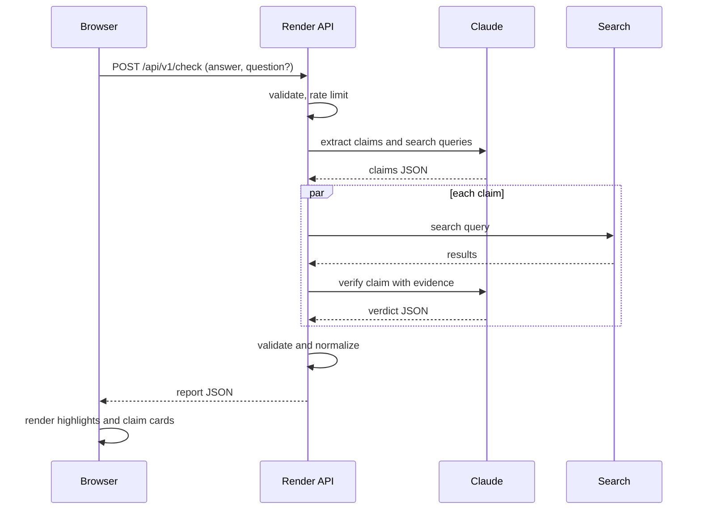
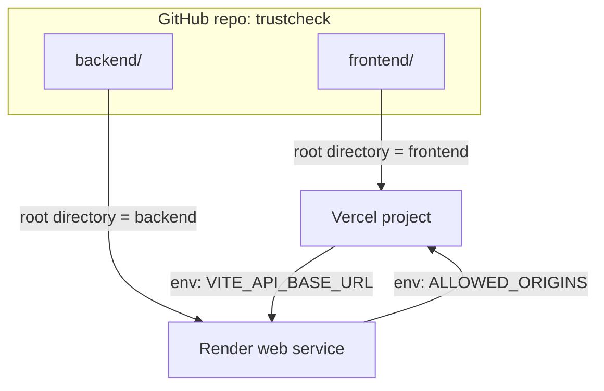

# TrustCheck Architecture Diagram and Deploy Guide


Follow this file top to bottom to get the backend live on Render, the frontend live on Vercel, and the two joined.

## 1. Request sequence


## 2. Deployment map


## 3. Before you deploy
- Repo is on GitHub with `frontend/` and `backend/` at the top level.
- `.env` is not committed. `.env.example` has empty values only.
- `gitleaks detect --source .` reports nothing.
- `backend/requirements.txt` exists with pinned versions.

## 4. Deploy the backend on Render
1. Render dashboard, New, Web Service, connect the GitHub repo.
2. Settings:
   - Root Directory: `backend`
   - Runtime: Python
   - Build Command: `pip install -r requirements.txt`
   - Start Command: `uvicorn app.main:app --host 0.0.0.0 --port $PORT`
   - Health Check Path: `/api/health`
3. Environment variables (type values here, never in the repo):
   - `ANTHROPIC_API_KEY`
   - `TAVILY_API_KEY`
   - `ENV` = `production`
   - `ALLOWED_ORIGINS` = `http://localhost:5173` for now (add the Vercel URL in step 6)
   - `RATE_LIMIT_PER_MINUTE` = a small number such as `5`
   - `DAILY_REQUEST_CAP` = a number you are comfortable paying for
4. Deploy and copy the service URL, for example `https://trustcheck-api.onrender.com`.
5. Test: open `<render-url>/api/health` and expect `{"status":"ok"}`. Open `<render-url>/docs` and expect 404.

## 5. Deploy the frontend on Vercel
1. Vercel dashboard, Add New, Project, import the same repo.
2. Settings:
   - Root Directory: `frontend`
   - Framework Preset: Vite
   - Build Command: `npm run build`
   - Output Directory: `dist`
3. Environment variable: `VITE_API_BASE_URL` = the Render URL from step 4.4. It is public by design. Never put a key here.
4. Deploy and copy the Vercel URL, for example `https://trustcheck.vercel.app`.

## 6. Join them (CORS)
1. In Render, set `ALLOWED_ORIGINS` to `https://trustcheck.vercel.app,http://localhost:5173` (your real Vercel URL, no trailing slash).
2. Save. Render redeploys.
3. Open the Vercel URL, run the sample answer.
4. A CORS error in the browser console means the origin does not match exactly. Fix scheme, spelling and trailing slash.

## 7. Final verification
| Check | Expected |
|-------|----------|
| Search built `frontend/dist` for `sk-`, `ANTHROPIC`, `TAVILY` | Nothing |
| `<render-url>/docs` and `/openapi.json` | 404 |
| 20 rapid requests to `/api/v1/check` | 429 after the limit |
| Send an empty body | Generic error with request id, no trace |
| Vercel response headers | nosniff, referrer policy, CSP present |

## 8. Demo day notes
- Render free services may sleep when idle. Hit `/api/health` about 5 minutes before presenting.
- Keep a screen recording of a full run as backup.
- If you rotate a key, change it in Render only, then redeploy.

## 9. Local development
```text
# backend
cd backend
python -m venv .venv && source .venv/bin/activate
pip install -r requirements.txt
cp ../.env.example .env        # fill values locally, never commit
uvicorn app.main:app --reload

# frontend
cd frontend
npm install
echo "VITE_API_BASE_URL=http://localhost:8000" > .env.local
npm run dev
```
